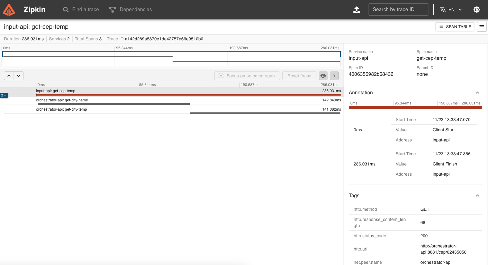

# goexpert-weather-api-otel

Projeto desenvolvido como parte do laboratório "Tracing distribuído e span" do treinamento GoExpert (FullCycle).

## O Desafio

O objetivo do desafio é criar um sistema em Go que:

- Receba um CEP.
- Identifique a cidade correspondente.
- Retorne o clima atual com temperaturas em graus Celsius, Fahrenheit e Kelvin, além do nome da cidade.

O projeto implementa OpenTelemetry (OTEL) e Zipkin para tracing distribuído. O sistema consiste em dois serviços:

- **Serviço A:** Sistema de entrada que recebe e valida o CEP.
- **Serviço B:** Sistema de orquestração que consulta os dados do CEP e retorna a localização e as temperaturas.

## Como Rodar o Projeto Manualmente

1. Clone o repositório:
   ```bash
   git clone https://github.com/mllcarvalho/go-expert-challenge-otel.git
   cd goexpert-weather-api-otel
   ```

2. Crie o arquivo `.env` com base no exemplo:
   ```bash
   cp .env.example .env
   ```

3. Configure sua API Key no arquivo `.env`:
   - A chave deve ser adicionada na variável `OPEN_WEATHERMAP_API_KEY`.
   - Para obter a chave:
     1. Acesse [https://openweathermap.org/](https://openweathermap.org/).
     2. Crie uma conta, se ainda não tiver.
     3. No menu superior, passe o cursor sobre o seu nome de usuário e clique em **My API keys**.
     4. Gere uma nova chave no bloco **Create key**.

4. Suba o ambiente com Docker Compose:
   ```bash
   docker-compose up -d
   ```

5. Realize uma chamada ao **input-api** para gerar os traces:
   ```bash
   curl -s "http://localhost:8080/cep" -d '{"cep": "13330250"}'
   ```

6. Acesse os traces no Zipkin:
   - URL: [http://localhost:9411](http://localhost:9411)
   - Dica: Clique sobre o span do `input-api` para visualizar os spans aninhados do `orchestrator-api`.

## Requisitos

### Serviço A (input-api):

- [x] O sistema deve receber um input de 8 dígitos via POST no formato JSON: `{ "cep": "02460040" }`.
- [x] Validar se o CEP é uma string com exatamente 8 dígitos.
- [x] Encaminhar o CEP validado para o **Serviço B** via HTTP.
- [x] Caso o CEP não seja válido, retornar:
  - **Código HTTP:** 422
  - **Mensagem:** `invalid zipcode`

### Serviço B (orchestrator-api):

- [x] Receber um CEP válido de 8 dígitos.
- [x] Consultar os dados do CEP e identificar a localização.
- [x] Retornar as temperaturas formatadas em Celsius, Fahrenheit e Kelvin, juntamente com a localização.
- [x] Responder nos seguintes cenários:
  - **Sucesso:**
    - **Código HTTP:** 200
    - **Body:** `{ "city": "São Paulo", "temp_C": 28.5, "temp_F": 83.3, "temp_K": 301.65 }`
  - **CEP inválido (com formato correto):**
    - **Código HTTP:** 422
    - **Mensagem:** `invalid zipcode`
  - **CEP não encontrado:**
    - **Código HTTP:** 404
    - **Mensagem:** `can not find zipcode`

## Requisitos para Entrega

- [x] Código-fonte completo da implementação.
- [x] Documentação explicando como rodar o projeto em ambiente de desenvolvimento.
- [x] Uso de Docker/Docker Compose para execução e testes.

## Traces com Zipkin

Veja os traces gerados pelo sistema no Zipkin:



